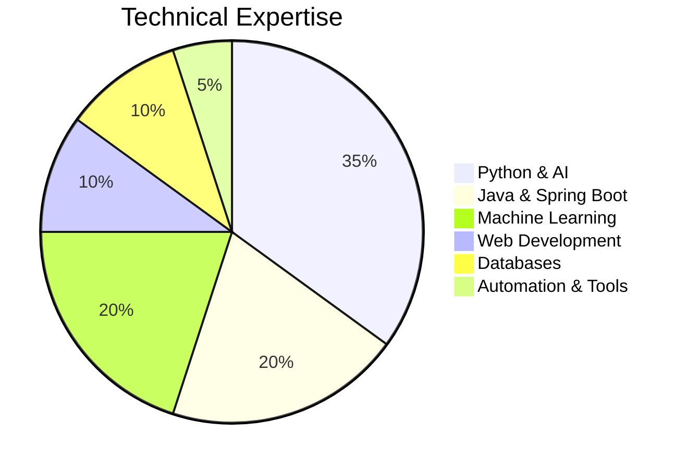
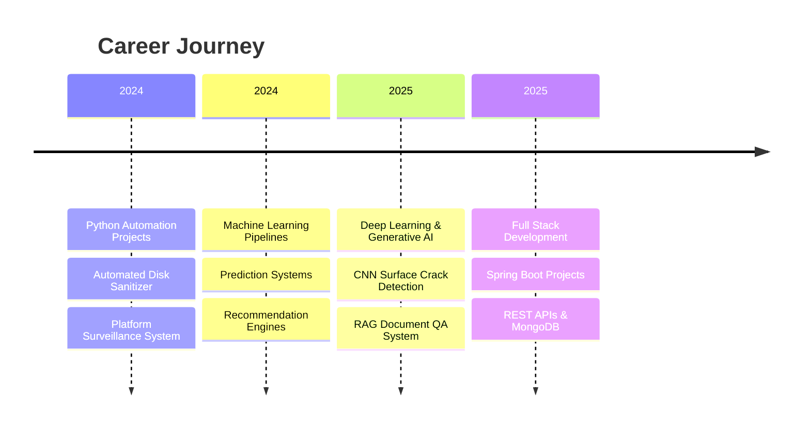

# 👋 Hi, I'm Ankita Dnyanoba Shinde

## 🚀 AI/ML Engineer | Python Developer | Full Stack Developer

Passionate MCA graduate focused on **Artificial Intelligence, Machine Learning, Deep Learning, Generative AI, Automation, and Full Stack Development**.

---

# 📊 GitHub Profile Overview

```text
💻 Languages       : Python, Java, C++, JavaScript, PHP
🤖 AI/ML Stack      : TensorFlow, Keras, Scikit-learn, OpenCV
🧠 Generative AI    : RAG, LLMs, FAISS, Ollama, Llama3
🌐 Backend          : Spring Boot, REST APIs
🗄️ Databases        : MySQL, MongoDB, Oracle
⚙️ Tools            : Git, GitHub, VS Code, Jupyter
```

---

# 🧠 Tech Skill Distribution



---

# 📈 Career Growth Timeline



---

# 🛠️ Tech Stack

## 💻 Programming Languages


## 🤖 AI / ML


## 🌐 Backend & Databases


---

# 🚀 Featured Projects

| Project | Tech Stack | GitHub |
|---|---|---|
| Intelligent Document QA System | Python, FAISS, LLMs, Streamlit | [Repository](https://github.com/theankita/Question_Answering_System) |
| Surface Crack Detection | CNN, TensorFlow, OpenCV | [Repository](https://github.com/theankita/Surface_Crack_Detection) |
| Financial Time Series Forecasting | LSTM, Deep Learning | [Repository](https://github.com/theankita/Financial_Time_Series) |
| EduTrackRecordsPortal | Java, Spring Boot, MongoDB | [Repository](https://github.com/theankita/Spring_Boot) |
| Platform Surveillance System | Python Automation | [Repository](https://github.com/theankita/Surveillance_System) |
| Automated Disk Sanitizer | Python, hashlib | [Repository](https://github.com/theankita/Automated_Disk_Sanitiser) |

---

# 📊 GitHub Stats


---

# 🌐 Connect With Me

- 🔗 GitHub: https://github.com/theankita
- 💼 LinkedIn: https://www.linkedin.com/in/ankitashhinde/
- 📧 Email: ankitashindeofficiall@gmail.com
- 📍 Pune, Maharashtra

---

# ✨ About Me

✔️ Strong foundation in AI, ML, Deep Learning & Generative AI  
✔️ Experience with Full Stack & Backend Development  
✔️ Passionate about solving real-world problems using technology  
✔️ Active GitHub contributor with multiple practical projects  
✔️ Interested in Intelligent Systems, Automation & Scalable Applications

---

# 🚀 Visitor Counter


---

# ⚡ Fun Fact

> I build AI systems, automation tools, and full-stack applications that solve practical real-world problems.

---

# 📌 How To Use This README

1. Create a repository with the same name as your GitHub username → `theankita`
2. Add a `README.md`
3. Paste this complete content
4. Commit changes
5. Your GitHub profile portfolio becomes live 🚀

---

export default function AnkitaPortfolio() {
  const skills = [
    { name: 'Python & AI', value: 35 },
    { name: 'Java & Spring Boot', value: 20 },
    { name: 'Data Science & ML', value: 20 },
    { name: 'Web Development', value: 10 },
    { name: 'Databases', value: 10 },
    { name: 'Automation & Dev Tools', value: 5 },
  ];

  const projectTimeline = [
    {
      year: '2024',
      title: 'Automation Projects',
      desc: 'Built Automated Disk Sanitizer and Platform Surveillance System using Python automation.',
    },
    {
      year: '2024',
      title: 'Machine Learning Projects',
      desc: 'Developed ML pipelines for prediction systems, recommendation engines, and customer segmentation.',
    },
    {
      year: '2025',
      title: 'Deep Learning & LLMs',
      desc: 'Implemented CNN-based Crack Detection and RAG-based Intelligent Document QA System.',
    },
    {
      year: '2025',
      title: 'Full Stack & Java Projects',
      desc: 'Created EduTrackRecordsPortal and Generic Data Structure Library using Spring Boot and C++.',
    },
  ];

  const projects = [
    {
      title: 'Intelligent Document QA System',
      tech: 'Python, Streamlit, FAISS, LLMs',
      link: 'https://github.com/theankita/Question_Answering_System',
      category: 'Generative AI',
    },
    {
      title: 'Surface Crack Detection',
      tech: 'CNN, TensorFlow, OpenCV',
      link: 'https://github.com/theankita/Surface_Crack_Detection',
      category: 'Deep Learning',
    },
    {
      title: 'Financial Time Series Forecasting',
      tech: 'LSTM, TensorFlow, Pandas',
      link: 'https://github.com/theankita/Financial_Time_Series',
      category: 'AI/ML',
    },
    {
      title: 'EduTrackRecordsPortal',
      tech: 'Java, Spring Boot, MongoDB',
      link: 'https://github.com/theankita/Spring_Boot',
      category: 'Full Stack',
    },
    {
      title: 'Platform Surveillance System',
      tech: 'Python Automation, psutil',
      link: 'https://github.com/theankita/Surveillance_System',
      category: 'Automation',
    },
    {
      title: 'Automated Disk Sanitizer',
      tech: 'Python, hashlib, smtplib',
      link: 'https://github.com/theankita/Automated_Disk_Sanitiser',
      category: 'Automation',
    },
  ];

  const expertise = [
    'Python Development',
    'Machine Learning',
    'Deep Learning',
    'Generative AI & LLMs',
    'Java & Spring Boot',
    'REST API Development',
    'Data Analytics',
    'Automation Scripting',
    'MongoDB & SQL',
    'Git & GitHub',
  ];

  return (
    <div className="min-h-screen bg-slate-950 text-white p-6 md:p-10 font-sans">
      <div className="max-w-7xl mx-auto space-y-10">

        <section className="grid md:grid-cols-2 gap-8 items-center">
          <div>
            <h1 className="text-5xl font-bold leading-tight">
              Ankita Dnyanoba Shinde
            </h1>
            <p className="mt-4 text-lg text-slate-300">
              AI/ML Engineer • Python Developer • Full Stack Developer
            </p>
            <p className="mt-6 text-slate-400 leading-relaxed">
              MCA graduate with hands-on experience in Machine Learning,
              Deep Learning, Generative AI, Automation Scripting, Java Development,
              and Full Stack Engineering. Passionate about solving real-world
              problems using scalable and intelligent software systems.
            </p>

            <div className="mt-6 flex flex-wrap gap-3">
              <a
                href="https://github.com/theankita"
                target="_blank"
                className="px-5 py-3 bg-white text-black rounded-2xl font-semibold shadow-lg"
              >
                GitHub
              </a>

              <a
                href="https://www.linkedin.com/in/ankitashhinde/"
                target="_blank"
                className="px-5 py-3 border border-slate-600 rounded-2xl"
              >
                LinkedIn
              </a>
            </div>
          </div>

          <div className="bg-slate-900 rounded-3xl p-6 shadow-2xl border border-slate-800">
            <h2 className="text-2xl font-semibold mb-6">Skill Distribution</h2>

            <div className="space-y-5">
              {skills.map((skill) => (
                <div key={skill.name}>
                  <div className="flex justify-between mb-1 text-sm">
                    <span>{skill.name}</span>
                    <span>{skill.value}%</span>
                  </div>
                  <div className="w-full bg-slate-700 rounded-full h-3">
                    <div
                      className="bg-cyan-400 h-3 rounded-full"
                      style={{ width: `${skill.value}%` }}
                    />
                  </div>
                </div>
              ))}
            </div>

            <div className="mt-10">
              <h3 className="text-xl font-semibold mb-4">Tech Stack Pie Diagram</h3>

              <div className="flex justify-center">
                <div className="relative w-64 h-64 rounded-full overflow-hidden border-4 border-slate-700"
                  style={{
                    background:
                      'conic-gradient(#38bdf8 0% 35%, #8b5cf6 35% 55%, #22c55e 55% 75%, #f59e0b 75% 85%, #ef4444 85% 95%, #f97316 95% 100%)'
                  }}
                >
                  <div className="absolute inset-16 bg-slate-950 rounded-full flex items-center justify-center text-center p-4">
                    <span className="text-sm text-slate-300 font-medium">
                      AI • Backend • ML • Web • DB • Tools
                    </span>
                  </div>
                </div>
              </div>
            </div>
          </div>
        </section>

        <section className="bg-slate-900 rounded-3xl p-8 border border-slate-800 shadow-xl">
          <h2 className="text-3xl font-bold mb-8">Technical Expertise</h2>

          <div className="grid grid-cols-2 md:grid-cols-5 gap-4">
            {expertise.map((item) => (
              <div
                key={item}
                className="bg-slate-800 rounded-2xl p-4 text-center text-sm font-medium hover:scale-105 transition"
              >
                {item}
              </div>
            ))}
          </div>
        </section>

        <section>
          <h2 className="text-3xl font-bold mb-8">Project Showcase</h2>

          <div className="grid md:grid-cols-2 xl:grid-cols-3 gap-6">
            {projects.map((project) => (
              <div
                key={project.title}
                className="bg-slate-900 border border-slate-800 rounded-3xl p-6 shadow-lg hover:-translate-y-1 transition"
              >
                <span className="text-xs uppercase tracking-widest text-cyan-400">
                  {project.category}
                </span>

                <h3 className="text-2xl font-semibold mt-3">
                  {project.title}
                </h3>

                <p className="text-slate-400 mt-3 text-sm leading-relaxed">
                  {project.tech}
                </p>

                <a
                  href={project.link}
                  target="_blank"
                  className="inline-block mt-5 text-cyan-300 font-medium"
                >
                  View Repository →
                </a>
              </div>
            ))}
          </div>
        </section>

        <section className="bg-slate-900 rounded-3xl p-8 border border-slate-800 shadow-xl">
          <h2 className="text-3xl font-bold mb-10">Career Growth Timeline</h2>

          <div className="relative border-l border-cyan-500 ml-4 space-y-10">
            {projectTimeline.map((item, index) => (
              <div key={index} className="ml-8 relative">
                <div className="absolute -left-11 top-1 w-6 h-6 rounded-full bg-cyan-400 border-4 border-slate-950" />

                <div className="bg-slate-800 rounded-2xl p-5 shadow-md">
                  <span className="text-cyan-400 font-semibold text-sm">
                    {item.year}
                  </span>

                  <h3 className="text-xl font-semibold mt-2">
                    {item.title}
                  </h3>

                  <p className="text-slate-400 mt-2 leading-relaxed text-sm">
                    {item.desc}
                  </p>
                </div>
              </div>
            ))}
          </div>
        </section>

        <section className="grid md:grid-cols-3 gap-6">
          <div className="bg-slate-900 rounded-3xl p-8 border border-slate-800 text-center">
            <h3 className="text-5xl font-bold text-cyan-400">10+</h3>
            <p className="mt-3 text-slate-400">Projects Completed</p>
          </div>

          <div className="bg-slate-900 rounded-3xl p-8 border border-slate-800 text-center">
            <h3 className="text-5xl font-bold text-violet-400">8.15</h3>
            <p className="mt-3 text-slate-400">MCA CGPA</p>
          </div>

          <div className="bg-slate-900 rounded-3xl p-8 border border-slate-800 text-center">
            <h3 className="text-5xl font-bold text-green-400">AI + Dev</h3>
            <p className="mt-3 text-slate-400">Hybrid Skill Profile</p>
          </div>
        </section>

        <footer className="text-center text-slate-500 pt-6 pb-10">
          <p>
            Designed for GitHub Portfolio Presentation • Ankita Shinde • 2026
          </p>
        </footer>
      </div>
    </div>
  );
}
