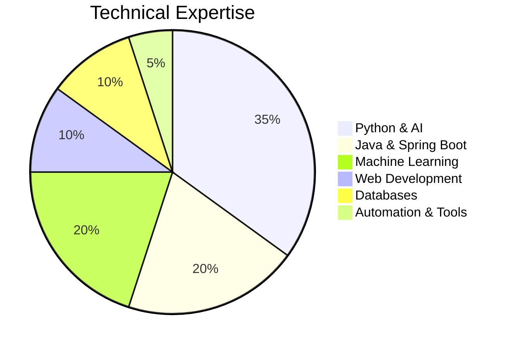

# 👋 Hi, I'm Ankita Dnyanoba Shinde

# 🚀 AI/ML Engineer | Python Developer | Full Stack Developer

---

# 📊 Technical Skill Distribution

---

# 📈 Career Growth
flowchart LR

A[2024 Python Automation] --> B[Disk Sanitizer]
A --> C[Surveillance System]

D[2024 Machine Learning] --> E[Prediction Models]
D --> F[Recommendation Engine]

G[2025 Deep Learning & LLMs] --> H[CNN Crack Detection]
G --> I[RAG QA System]

J[2025 Full Stack Development] --> K[Spring Boot APIs]
J --> L[MongoDB Integration]

---

# 🛠️ Tech Stack

### 💻 Languages

### 🤖 AI / ML

### 🌐 Backend & Database

---

# 🚀 Featured Projects

| Project | Tech |
|---|---|
| 🤖 Intelligent Document QA System | RAG, LLMs, FAISS |
| 🧠 Surface Crack Detection | CNN, TensorFlow |
| 📈 Financial Forecasting | LSTM, Deep Learning |
| 🌐 EduTrackRecordsPortal | Spring Boot, MongoDB |
| ⚙️ Surveillance System | Python Automation |
| 🗂️ Disk Sanitizer | Python Scripting |

---

# 📊 GitHub Analytics

---

# 🌐 Connect With Me

- 🔗 GitHub: https://github.com/theankita
- 💼 LinkedIn: https://linkedin.com/in/ankitashhinde
- 📧 Email: ankitashindeofficiall@gmail.com
- 📍 Pune, Maharashtra

---

# ✨ About Me

✔️ AI/ML & Deep Learning Enthusiast  
✔️ Full Stack Developer  
✔️ Generative AI & LLM Explorer  
✔️ Automation Scripting Expert  
✔️ Passionate About Real-World Problem Solving

---

