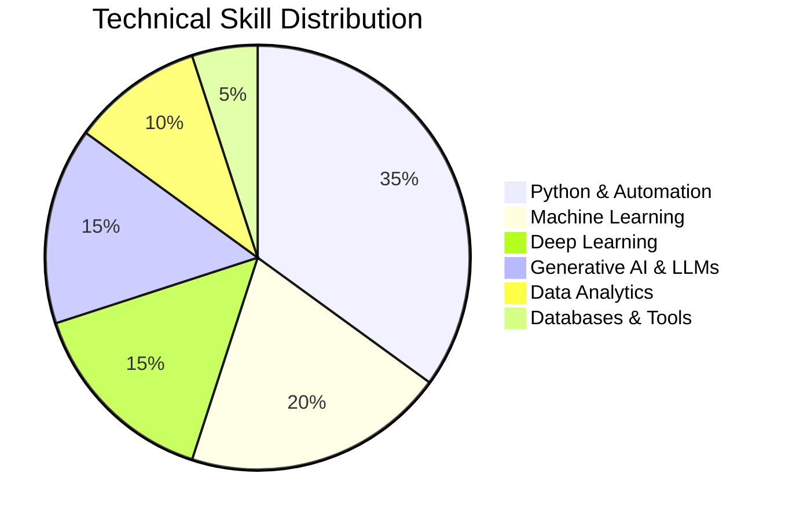
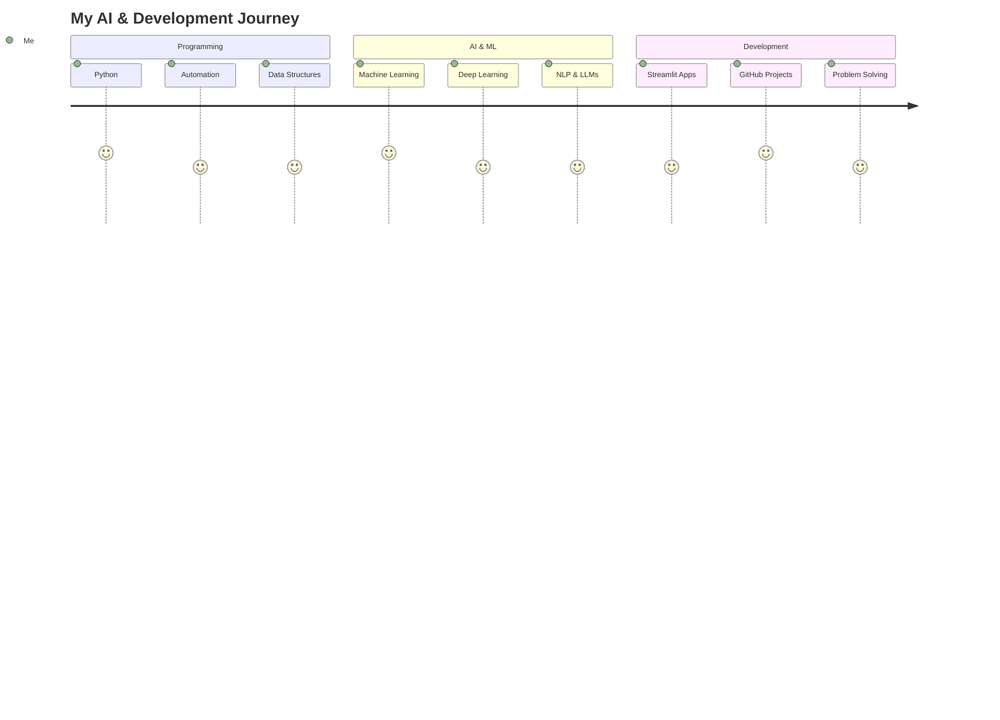
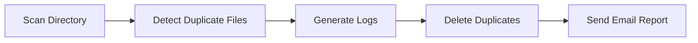
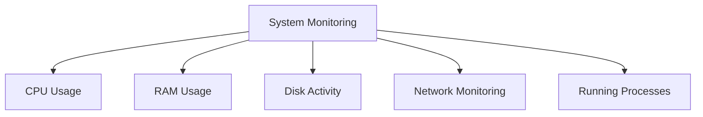
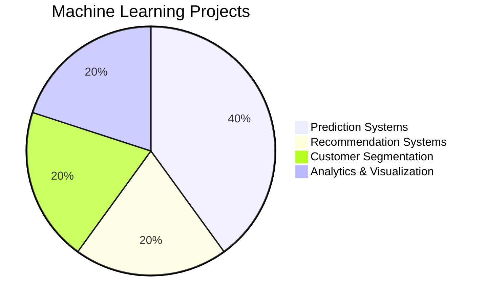
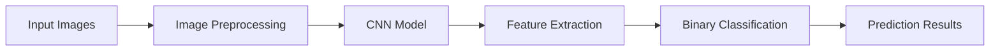
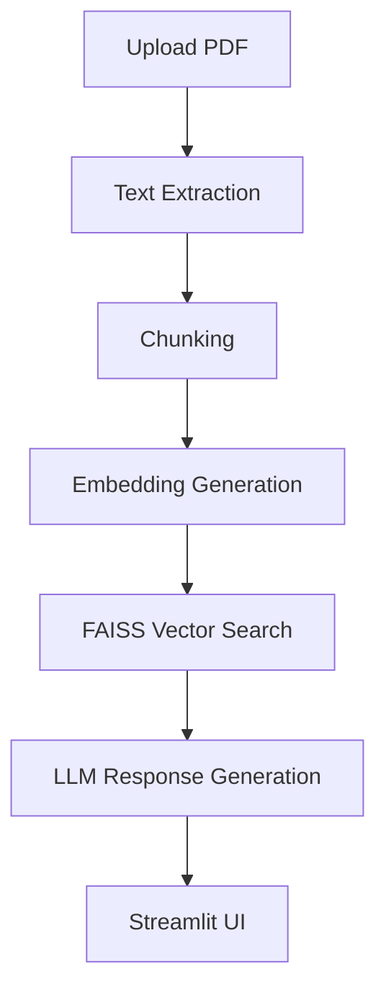

# Hi there, I'm Ankita 👋

# 💻 Python Developer | 🤖 AI & ML Enthusiast | 🚀 Generative AI Explorer

---

# 🌟 About Me

🎓 MCA Graduate from Bharati Vidyapeeth Deemed University
💡 Passionate about AI, Automation, and Intelligent Systems
📊 Skilled in Machine Learning, Deep Learning & Data Analytics
🚀 Exploring Generative AI, LLMs, and RAG Applications
🛠️ Building real-world AI and Automation projects using Python

---

# 📊 Technical Skills Overview

---

# 🚀 Technology Stack

## 👨‍💻 Programming Languages

---

## 🤖 AI / ML / Deep Learning

---

# 📈 Learning Journey

---

# 📌 Featured Projects

## 🔹 Automated Disk Sanitizer

### 📌 Project Workflow

### ✨ Features

* Duplicate file detection using MD5 checksum
* Automated scheduling
* Log generation with timestamps
* Email automation using smtplib

🔗 GitHub Repo:
[https://github.com/theankita/Automated_Disk_Sanitiser](https://github.com/theankita/Automated_Disk_Sanitiser)

---

## 🔹 Platform Surveillance System

### 📊 Monitoring Components

🔗 GitHub Repo:
[https://github.com/theankita/Surveillance_System](https://github.com/theankita/Surveillance_System)

---

## 🔹 Machine Learning Projects

### 📈 ML Project Distribution

### 📊 Projects Included

* House Price Prediction
* Ad Click Prediction
* Customer Segmentation
* Movie Recommendation System
* Industrial ML Pipelines
* Data Analytics & Visualization

🔗 GitHub Repo:
[https://github.com/theankita/Python_Case_Studies](https://github.com/theankita/Python_Case_Studies)

---

## 🔹 Surface Crack Detection using CNN

### 🧠 Deep Learning Architecture

🔗 GitHub Repo:
[https://github.com/theankita/Surface_Crack_Detection](https://github.com/theankita/Surface_Crack_Detection)

---

## 🔹 Intelligent Document Question Answering System

### 🤖 RAG Workflow

🔗 GitHub Repo:
[https://github.com/theankita/Question_Answering_System](https://github.com/theankita/Question_Answering_System)

---

# 📊 GitHub Analytics

---

# 🔥 GitHub Streak

---

# 🏆 Achievements

🏅 Built multiple AI, ML, Automation & GenAI projects
🏅 Developed practical RAG & LLM applications
🏅 Strong hands-on experience in Python & AI Development
🏅 Created real-world intelligent automation systems

---

# 📫 Connect With Me

---

## ⭐ "Code. Learn. Build. Repeat."

